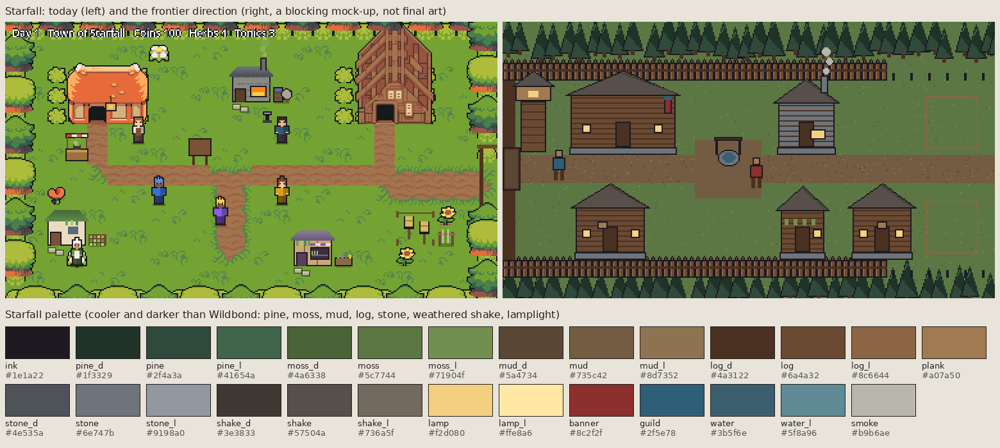

# Starfall village: look sheet

Follows the arcade guide ([README.md](README.md)); this page only adds what is Starfall's own. Written 2026-10-09 by
the Art direction thread. It is the art half of **SF2.6 "its own place"** (game review GR-5): today Starfall borrows
Wildbond's cottages, barn and summer greens, so the two games look like one.

The right half is a **blocking mock-up**, not final art: it fixes the palette, the layout and the sizes. The buildings
in it are still too alike; the list below says how each one must differ. It is drawn by
[tools/art/starfall_mockup.py](../../tools/art/starfall_mockup.py) (rerun with `python3 tools/art/starfall_mockup.py`),
which also writes [starfall/mockup-1x.png](starfall/mockup-1x.png) at the game's real 384 by 216 size and
[starfall/palette.gpl](starfall/palette.gpl) from the same colour list. Today's screenshot is
[starfall/today-1x.png](starfall/today-1x.png). Wildbond is leaving the Ninja Adventure pack for its own art; Starfall
leaves it too, piece by piece, as the ART-SF tasks land.

## In a line
A log-walled frontier town cut out of a pine forest, at the edge of the wilds: cooler and darker than Wildbond, built
from timber and stone under weathered wooden roofs, with mud underfoot and lamplight at night. It should feel new, a little rough and
growing: empty staked plots inside the wall, stakes where the wall will go next.

## Palette
[starfall/palette.gpl](starfall/palette.gpl), 27 colours, three values per material: pine (forest), moss (grass),
mud (road and square), log and plank (walls), stone (footings, smithy, well), shake (weathered grey-brown wooden roofs), plus
ink and lamplight (both shared with Wildbond), the guild's blue, a banner red, water and smoke. Add a colour only with a reason, and stay under 32.

## What must differ from Wildbond
| | Wildbond (Larkhaven) | Starfall |
|---|---|---|
| Ground | bright summer grass, flowers | darker moss, mud road and square, ferns and stumps; no flowers inside the wall |
| Trees | round broadleaf crowns with teal pines between | only pines, greener and darker, in a dense edge; stumps where the town was cleared |
| Walls | whitewash and timber frame | round logs (horizontal), stone footings |
| Roofs | slate blue (and the red barn) | weathered wooden shakes, grey-brown; never blue or red (the guild's banner and the lamps carry the colour) |
| Edges of town | hedges and open fields | a log palisade with a gate and a watchtower |
| Light | sunny, warm | cool daylight; warm lamplight in windows and on posts, brighter at night |

**The check (GR-5):** put a Starfall screenshot beside a Larkhaven one. Nobody should be able to confuse them, even
shrunk to a thumbnail.

## Layout
The road runs **east from the gate** (west wall) through a square with the well, then on to the plots you haven't
built on yet. The Guild Hall faces the square; the inn and the tavern sit on the road near it; the smithy, the
apothecary and the healer along the road further in; the training yard beside the smithy (SF2.3's placement bonus).
The map scrolls (SF2.6), so the town can grow east as the wall is extended.

## Buildings and props (sizes are the drawing's, footprints are what you bump into)
A person is 16 by 24 pixels. Heights are in tiles above the footprint, for a later 3D version.

| Piece | Picture (px) | Footprint (tiles) | Height | Known by |
|---|---|---|---|---|
| Guild Hall | 96 x 80 | 6 x 3 | 4 | a long log hall, the widest roof, double door, the guild's blue banner on a pole |
| Inn | 64 x 80 | 4 x 3 | 4.5 | two storeys, the only upper windows, a hanging sign, the most lit windows at night |
| Tavern | 64 x 56 | 4 x 2 | 3 | a covered porch on posts, barrels by the door, a hanging tankard sign |
| Smithy | 64 x 56 | 4 x 2 | 3 | stone walls (the only stone building), open front with the forge's glow, a tall chimney with smoke, anvil outside |
| Apothecary | 32 x 56 | 2 x 2 | 3 | the narrowest building, steep roof, herbs drying on a rack under the eaves, a coloured bottle in the window |
| Healer | 48 x 48 | 3 x 2 | 2.5 | a low hut, a white cloth over the door, a bench and a small herb bed |
| Watchtower | 32 x 80 | 2 x 2 | 5 | the tallest thing in town: a platform on legs, a roofed top, a lantern (lit and unlit) |
| Gate | 48 x 48 | 3 x 1 | 3 | two thick posts and a crossbeam, doors open and shut |
| Palisade | 16 x 32 per piece | 1 x 1 | 2 | pointed logs; straight, corner, end; stakes for the wall to come |
| Well | 32 x 32 | 2 x 1 | 1.5 | round stone, wooden frame and bucket |
| Job board | 32 x 32 | 2 x 1 | 2 | a roofed board with notices (it is how jobs arrive) |
| Training yard | 64 x 48 | 4 x 3 | 1.5 | posts, a straw dummy, a weapon rack, a rope fence |
| Plot (empty) | 48 x 48 | 3 x 3 | 0 | four stakes and a string line on bare mud |

**Props** (one tile or less): barrels, crates, firewood stack, lantern post (lit and unlit), cart (2 x 1), bunting
for good days (SF2.2), a festival flag line later (SF3.4), stumps, ferns, rocks.

## Motion
Smoke from the smithy and the inn, the banner and bunting moving a little, the forge glow breathing, lamps lighting at
dusk. Nothing else moves on its own.

## The drawing tasks
The pieces are split into tasks ART-SF-1 to ART-SF-6 in [docs/QUEUE.md](../QUEUE.md) ("Art tasks"), for any AI to
claim. Wiring them into the game (the new layout, the scrolling map, footprints in data) is SF2.6 itself.
