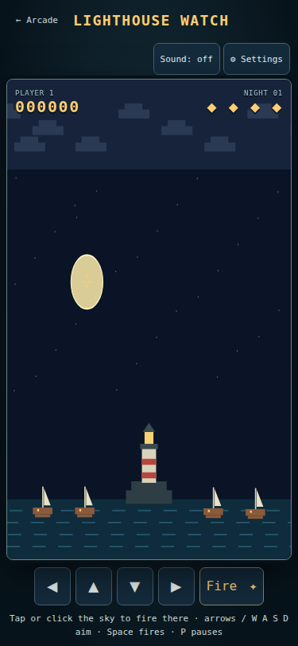
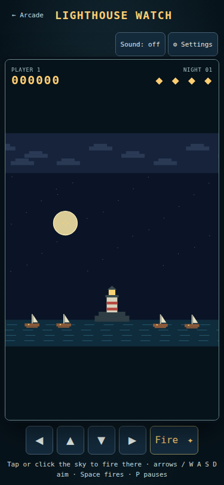
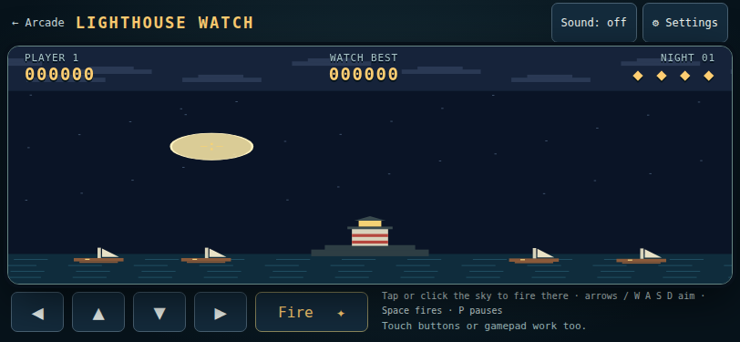
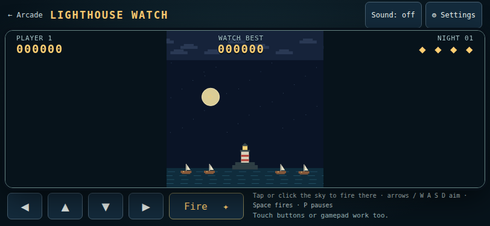
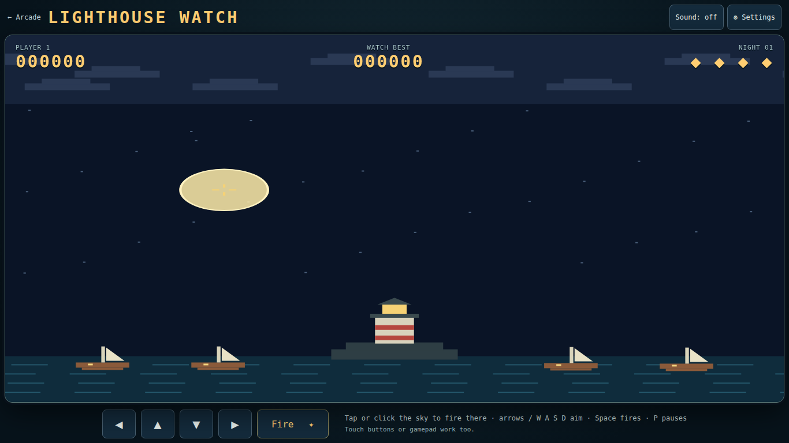
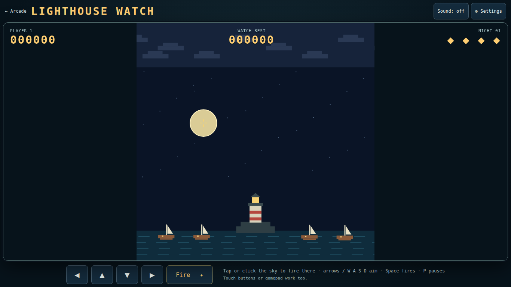
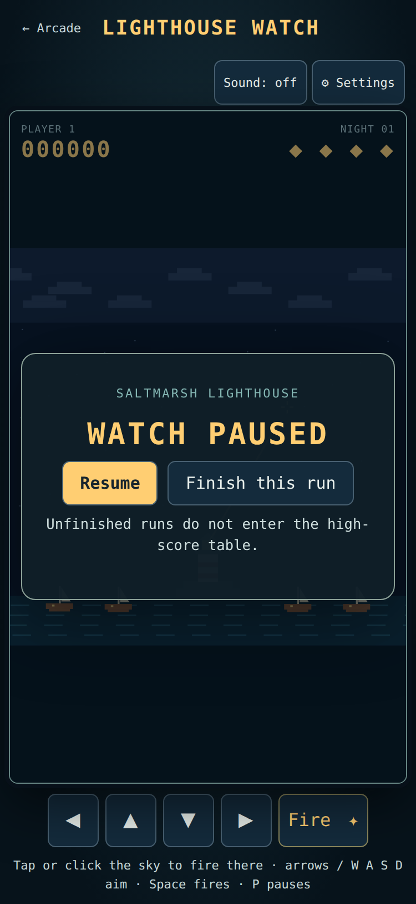
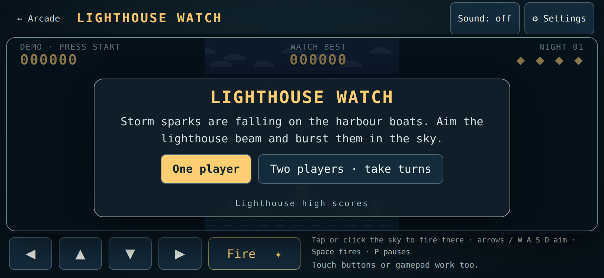

# Lighthouse Watch display and controls — AC2.1, 2026-10-10

Original base: `5e1fc44ccac17f2d4c9fd5645c57aca827613e4a`. Branch updated with main through `28cee8c` after ART-SF-7 and the evening/yard follow-up merged; both sets of shared status notes retained. PR: [#163](https://github.com/ecbarish/idle-arcade/pull/163).

The old canvas stretched 640×640 harbour coordinates separately across its width and height. A 36-unit circular burst became an oval. Rendering now uses one scale, centred in the available canvas, with dark cabinet margins. The whole harbour stays visible. Drawing is clipped to its square so clouds cannot spill into those margins. Pointer coordinates invert the same fit, recalculated at each tap; taps in margins do nothing. Canvas touch gestures no longer compete with browser panning.

Keyboard, touch-pad and gamepad bindings, model rules, balance and the v1 high-score format are unchanged. Pause/blur/visibility input cleanup already existed; the new checks verify it through rotation and held-input cases.

## Verification

- `tests/lighthouse-watch.html`: **87 checks**, including the existing start/end/two-player/initials/gamepad flows; six fitted screen sizes; three independently calculated screen targets per size; margin rejection; cancelled touch; focus loss; paused rotation and resume; unchanged v1 score-save reload.
- The new screen-target assertion **fails against the original game.js**, then passes with the fix. See [baseline-check.txt](baseline-check.txt).
- [touch-check.json](touch-check.json): nine Playwright touchscreen cases, portrait → landscape → portrait at device pixel ratios 1, 2 and 3; equal render scale, correct targets, firing, no overflow, disabled canvas panning. Pause → rotate → resume and finish-to-title also pass. No page errors. This uses Chromium touch emulation, not a physical phone.
- Full repository checks: **all 16 suites pass**, including Wildbond Godot 1269/0 and Starfall Godot 147/0. Original results: [all-checks.txt](all-checks.txt). Current-main initial results (snapshot before the stale-import Starfall process finished): [current-main-checks.txt](current-main-checks.txt); this run exposed Storm Front’s intermittent touch-fire failure and a Lighthouse test-fixture race (a fresh wave spark spawned after the planted spark was correctly popped). The Lighthouse fixture now postpones only that unrelated spawn and restores its timer afterwards; assertions are unchanged. Its wait helper also allows actual animation frames to run on busy hosts. [Cabinet recheck](cabinet-recheck-fixed.txt) passes both cabinets. Final browser results: [final-browser-checks.txt](final-browser-checks.txt), **14/14 pass**. Wildbond native checks passed **1269/0** in the initial current-main run. Starfall’s cached imports had not picked up the newly merged art; a fresh import then [Starfall recheck](starfall-current-checks.txt) passes **149/0**. All 16 suites are therefore verified on the integrated branch across these runs; the initial current-main combined run was not green. No assertions or runner checks were relaxed.
- Images inspected for proportions, visible boats, controls, title and pause-panel readability. The square fit intentionally leaves margins on rectangular screens; in short landscape the harbour is smaller rather than stretched.

## Before and after

Frozen synthetic burst fixtures show the same radius and position in the old and new renderers. Pause/title captures use the actual game UI.

| Screen | Before | After |
|---|---|---|
| Phone, 375×812 |  |  |
| Landscape, 812×375 |  |  |
| Desktop, 1366×768 |  |  |




Reproduce from the repository root with Playwright available on `NODE_PATH` and your browser on `CHROME_PATH`:

```sh
node tools/run-all-checks.cjs lighthouse-watch
node docs/playtests/lighthouse-watch-display/touch-check.cjs
node docs/playtests/lighthouse-watch-display/capture.cjs before
node docs/playtests/lighthouse-watch-display/capture.cjs after
```
