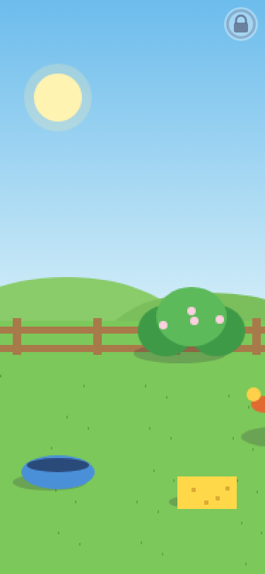
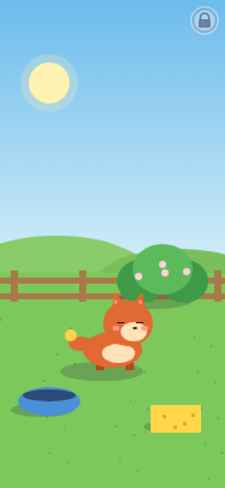
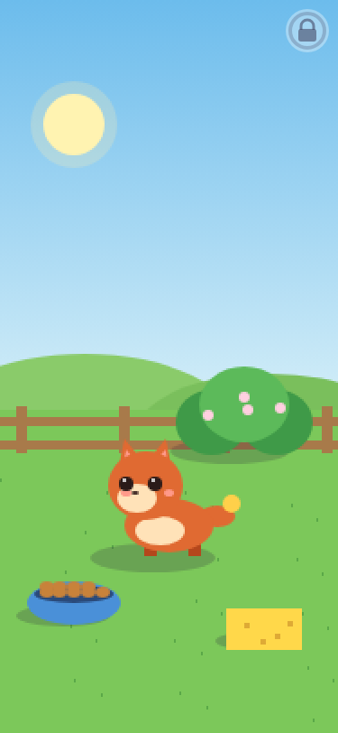
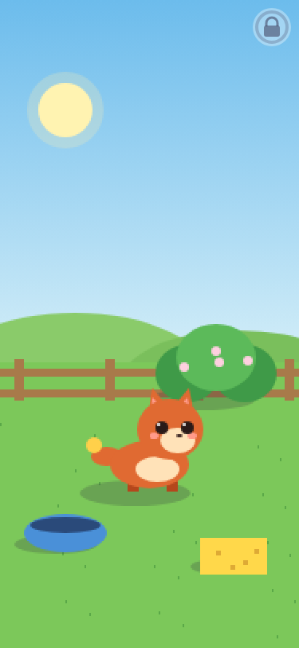

# Little Ranch interruption and resize review (LR2)

Tested implementation: `6284d1437c4d9e88d6aa091b8eb814692e4b0268`, against main `95412d5ec7e9bc37beeefb1cc396617482f92182`.

- [Full CI](https://github.com/ecbarish/idle-arcade/actions/runs/38059326850): all 14 suites pass, including 49 Little Ranch checks (11 new), 1,235 Wildbond Godot checks and 130 Starfall Godot checks.
- [Chromium review](https://github.com/ecbarish/idle-arcade/actions/runs/38059326879): 15 review checks pass, 16 actual screenshots. [Original capture artifact](https://github.com/ecbarish/idle-arcade/actions/runs/38059326879/artifacts/11672187518) (14-day retention); rerun with `node tools/playtest/little-ranch-review.cjs`.
- Reproduced both bugs on baseline, then verified the candidate: meals work after switching to Peekaboo and back; rotating from ultrawide to portrait keeps the baby on screen.
- A third interruption case is covered: choosing food near the end of the peek animation must not let its old return-home callback replace eating.
- Resize coverage includes idle, walking to food, eating, hiding, returning home, sleeping, automatic bathing and an active sponge drag. Viewports: 320x568, 375x812, 667x375, 1366x768, 1920x1080 and 3440x1440.
- The 49-check browser suite passes twice in the same isolated context. Existing `little-ranch-settings-v1` sound-off JSON and a synthetic unrelated game save remain byte-for-byte unchanged; sound preference survives reload. Little Ranch has no saved visit/progress, so there is no progress migration. No player storage was accessed.
- Additional logic-only review: 63 VM scenario checks passed (50 resize, 10 activity completion, 3 feeding interruptions). This does not stand in for browser rendering.
- Screenshots were visually inspected for the before/after portrait rotation, phone/landscape/laptop/desktop/ultrawide feeding, and phone Peekaboo. The baby and controls remain inside the scene; hiding intentionally puts the baby behind the bush.

## Before and after

The two rotation captures below are the same resize route, with the old implementation and the repaired implementation. Feeding captures show the old stuck bowl and the successful later meal on the repaired version.

## Boundaries

No game-version or save-key change, new art, new game rules, merge or deployment. Tests ran in GitHub Actions Chromium because local Chromium cannot create its required socket in this executor. Sound audibility and real-device touch latency were not evaluated. The required all-suite check must also pass on the final documentation/screenshot commit before review readiness.
